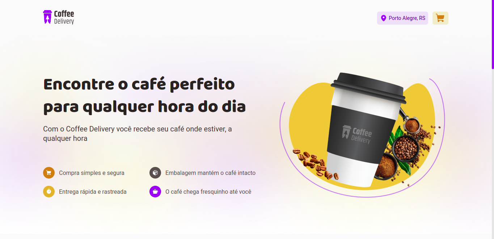
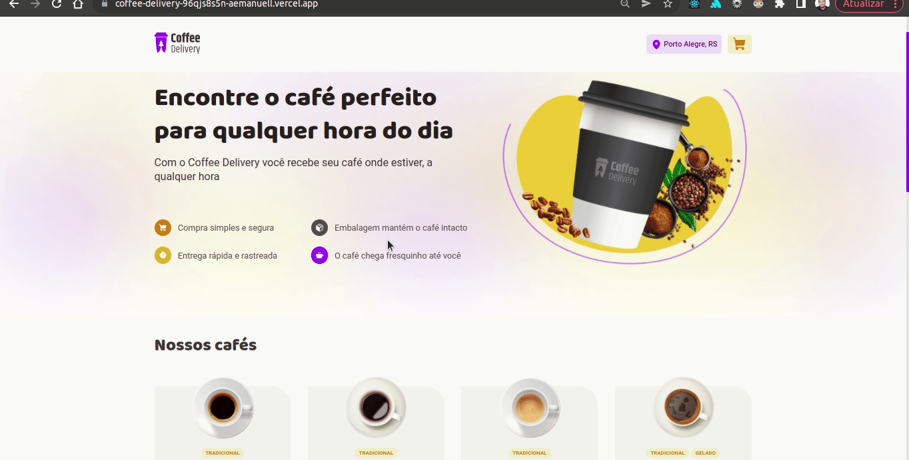
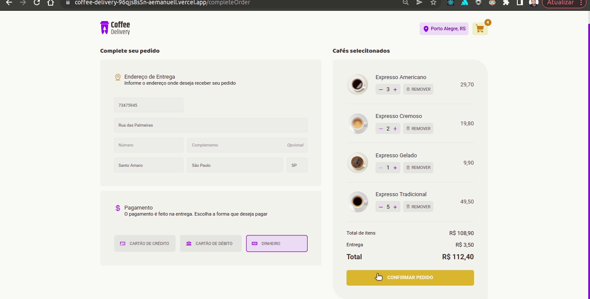

<h1 align="center"></h1>
<p align="center">O Coffe Delivery é uma loja fictícia.>

<p align="center">
 <a href="#sobre">Sobre</a> •
 <a href="#experiencia">Objetivo</a> •
 <a href="#roteiro">Roteiro</a> • 
 <a href="#tecnologias">Pilha de Tecnologias</a> • 
 <a href="#autor">Autor</a>
</p>

<h4 align="center"> 
	✅  &nbsp; ▶ Coffee Dellivery.
</h4>

<br>

### 🛠️ Para rodar o projeto

1. Realizar o clone ou o download do repositório;
2. Executar `npm install` ou `yarn install` para instalar as dependências;
3. Executar `npm run dev` ou `yarn dev` para rodar a aplicação;

<br />



<br><br>

[Visão Geral](#visao)
===================

## 🛠 [Objetivo](#objetivo)
<br>
  &nbsp; &nbsp; &nbsp; &nbsp; ▶ &nbsp; Este projeto trata-se de uma loja fictícia de delivery de café. O projeto foi um desafio da trilha nova de react da Rocketseat. Para este desafio, foi utilizado conceitos um pouco mais avançados desenvolvendo do zero uma aplicação de encomenda de cafés.

<br>

## 📝 [Roteiro](#roteiro)

<br>

📍 Confira nosso quadro para mais detalhes sobre o que já foi construido.
<br>

- [x] Armazezamento no LocalStorage
- [x] Lisategem de cafés
- [x] Fomulário de entrega
- [x] Items no carrinho
- [x] Alteração do carrinho de compra
- [x] Confirmação do pedido
- [x] Detalhes da entrega

📌 Ainda haverá uma nova versão, confira os próximos passos.

-   [ ] próxima versão do History Timer (React, TypeScript, Javascript, Node.Js, MongoDB, API)

## ⛳ [Objetivo](#experiencia)

Este projeto é para fins de estudo, uma pequena aplicação do que aprendi em desenvolvimento web com React usando TypeScript.

    📌 TypeScript
    📌 Vite
    📌 ContextAPI
    📌 Styled Components
    📌 UseReducer
    📌 React Router Dom
    📌 React Hook Form
    📌 useEffect, useState
    📌 fomulário com zod

Espero que este projeto alcance o objetivo principal que é apresentar minha experiência com Desenvolvedor front-end React TypeScript

<br>

## 💻 [Tecnologias](#tecnologias)

**Construindo um React Form com react-hook-form e zod**

-  Aplicando uma combinação de react-hook-form e zod para criar um formulário completo com validação.

```json
          import { CompleteOrderForm } from "./components/CompleteOrderform";
          import { SelectedCoffees } from "./components/SelectedCoffees";
          import { CompleteOrderContainer } from "./styles";
          import { useForm, FormProvider } from "react-hook-form";
          import * as zod from "zod";
          import { zodResolver } from "@hookform/resolvers/zod";
          import { useNavigate } from "react-router-dom";
          import { useCart } from "../../hooks/useCart";

          enum PaymentMethods {
            credit = "credit",
            debit = "debit",
            money = "money",
          }

          const confirmOrderFormValidationSchema = zod.object({
            cep: zod.string().min(1, "Informe o CEP"),
            street: zod.string().min(1, "Informe o Rua"),
            number: zod.string().min(1, "Informe o Número"),
            complement: zod.string(),
            district: zod.string().min(1, "Informe o Bairro"),
            city: zod.string().min(1, "Informe a Cidade"),
            uf: zod.string().min(1, "Informe a UF"),
            paymentMethod: zod.nativeEnum(PaymentMethods, {
              errorMap: () => {
                return { message: "Informe o método de pagamento" };
              },
            }),
          });

          export type OrderData = zod.infer<typeof confirmOrderFormValidationSchema>;

          type ConfirmOrderFormData = OrderData;

          export function CompleteOrderPage() {
            const confirmOrderForm = useForm<ConfirmOrderFormData>({
              resolver: zodResolver(confirmOrderFormValidationSchema),
              defaultValues: {
                paymentMethod: undefined,
              },
            });

            const { handleSubmit } = confirmOrderForm;

            const navigate = useNavigate();
            const { cleanCart } = useCart();

            function handleConfirmOrder(data: ConfirmOrderFormData) {
              navigate("/orderConfirmed", {
                state: data,
              });
              cleanCart();
            }

            return (
              <FormProvider {...confirmOrderForm}>
                <CompleteOrderContainer
                  className="container"
                  onSubmit={handleSubmit(handleConfirmOrder)}
                >
                  <CompleteOrderForm />
                  <SelectedCoffees />
                </CompleteOrderContainer>
              </FormProvider>
            );
          }
```

<br>

&nbsp;&nbsp;&nbsp;&nbsp; 

&nbsp;&nbsp;&nbsp;&nbsp; 

&nbsp;&nbsp;&nbsp;&nbsp;

&nbsp;&nbsp;&nbsp;&nbsp; 

&nbsp;&nbsp;&nbsp;&nbsp; 

&nbsp;&nbsp;&nbsp;&nbsp; 

&nbsp;&nbsp;&nbsp;&nbsp; 

&nbsp;&nbsp;&nbsp;&nbsp;

&nbsp;&nbsp;&nbsp;&nbsp; 

&nbsp;&nbsp;&nbsp;&nbsp; 

&nbsp;&nbsp;&nbsp;&nbsp; 

<br>

## 🎬 [A seguir alguns screenshots do projeto Coffee Delivery]()

<br>

<p align="center">
  <kbd>
    <div align="center"></div>
  </kbd>
</p>

<p align="center">
  <kbd>
    <div align="center"></div>
  </kbd>
</p>